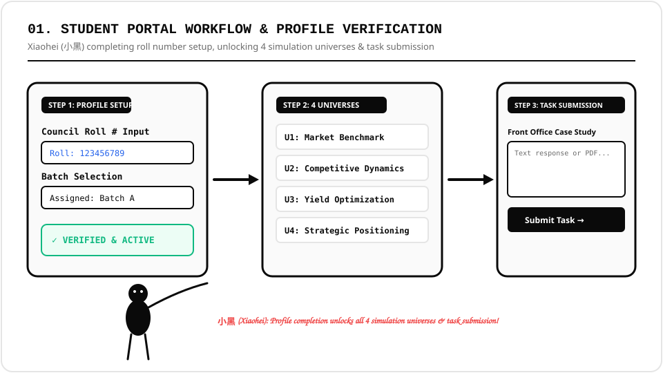
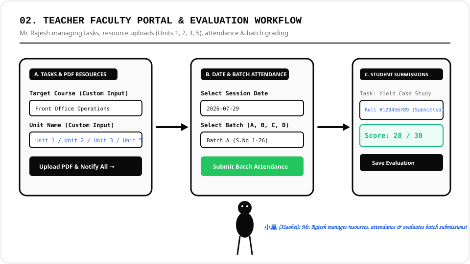
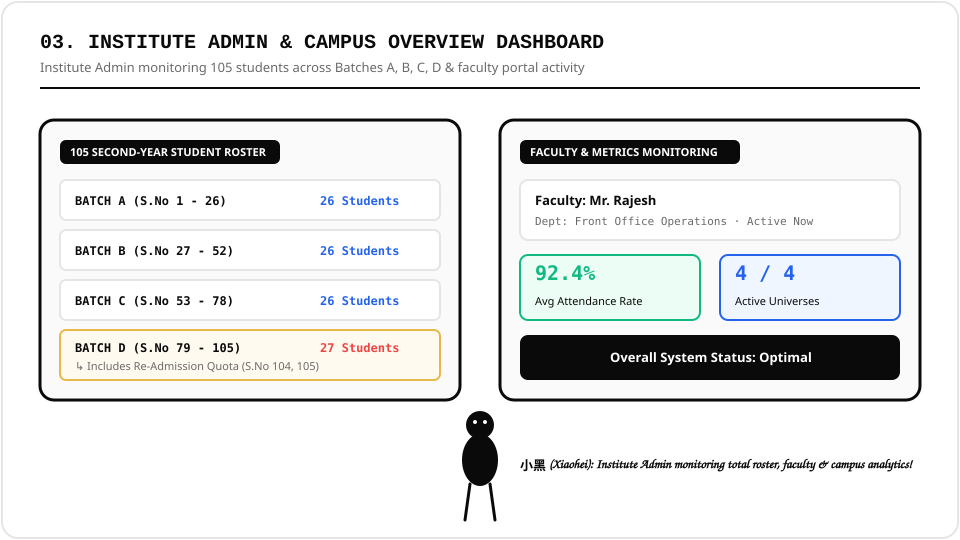

# Scholaria Campus Connect Hub
> **IHM Hyderabad — Department of Front Office Operations**  
> *Second Year B.Sc. in Hospitality & Hotel Administration (Semester 3)*

Developed & Maintained by **[@harshaparisha](https://github.com/harshaparisha)**

---

## 🎯 Main Motive & Core Vision

**Scholaria Campus Connect Hub** is an advanced academic and hotel simulation portal custom-built for **Institute of Hotel Management (IHM) Hyderabad**. Spearheaded by **Mr. Rajesh** in the **Department of Front Office Operations**, the platform bridges real-world hospitality revenue management with digital classroom administration.

### Why We Developed This Platform:
1. **Hotel Revenue & Market Simulation**: Provides second-year students hands-on simulation across 4 core Front Office strategy domains:
   - *Universe 1: Market Benchmark*
   - *Universe 2: Competitive Dynamics*
   - *Universe 3: Yield Optimization*
   - *Universe 4: Strategic Positioning*
2. **105 Second-Year Student Roster Management**: Digital tracking for all 105 students partitioned into **Batches A, B, C, and D**, including dedicated tracking for Re-Admission quota students (S.No 104 & 105 in Batch D).
3. **Streamlined Resource & Task Distribution**: Allows faculty members to directly publish custom learning units (Units 1, 2, 3, and 5) with downloadable PDF materials and assign practical hotel operations tasks.
4. **Batch Attendance & Submission Evaluation**: Enables real-time date and batch-wise attendance marking, along with dedicated submission evaluation where teachers review, grade, and provide instant feedback to students.

---

## 🖼️ System Workflows & Illustrations

Below are 3 system workflow visualizers starring **Xiaohei (小黑 / "Little Black")**, representing the student, teacher, and administrative operations:

### 1. Student Portal Access & Profile Setup Workflow
Students complete mandatory council roll number and batch verification to unlock access to all 4 hotel simulation universes, unit learning materials, and assignment submission portals.

---

### 2. Faculty Management & Evaluation Workflow
Faculty member **Mr. Rajesh** publishes custom tasks, uploads PDF unit resources (Units 1, 2, 3, 5), logs daily batch attendance by date and topic, and evaluates student assignment submissions.

---

### 3. Institute Admin & Campus Operations Overview
Institute Admin monitors overall campus activity, active user verification, batch distribution (105 total students across Batches A, B, C, D including re-admissions), and real-time attendance analytics.

---

## ✨ Developed By
This project is completely designed, engineered, and developed by **[@harshaparisha](https://github.com/harshaparisha)** for **IHM Hyderabad Front Office Operations**.
